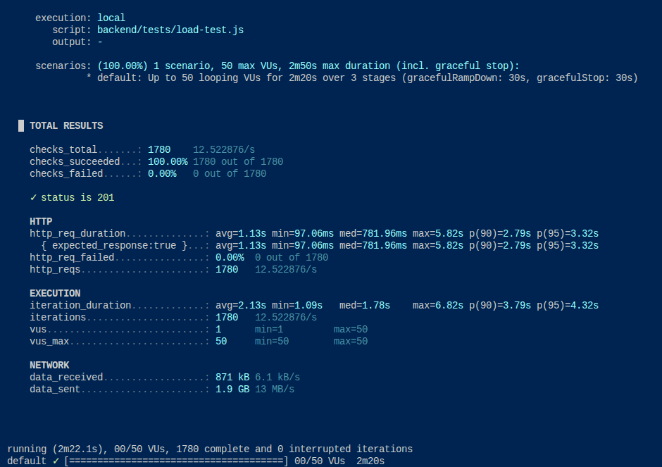

# Performance

## Budget de performance Frontend

Inscrire une limite pour le poids des fichiers JS (fichier _vite.config.ts_) permet de s'assurer que l'interface reste **fluide** et interactive.

J'ai choisi de garder la valeur par défaut de 500 Ko car c'est le standard technique pour assurer un affichage en moins de 3 secondes. Cette configuration agit comme une sonde de sécurité. Si l'ajout d'une nouvelle librairie tierce alourdit subitement le bundle, Vite lèvera un avertissement explicite dans le terminal. Cela empêche la dégradation silencieuse des performances et force à **évaluer le coût** d'une librairie par rapport à son utilité.

## Rapport de test de charge k6 : endpoint de téléversement

[k6](https://k6.io/) est un outil pour tester la performance d'une application. Pour lancer ce test de charge, entrez assurez-vous d'avoir [k6](https://k6.io/) installé sur votre machine.

Entrez `k6 run backend/tests/load-test.js` à la racine du projet.

### 1. Paramètres de l'exécution

- **Cible** : `POST /uploads/anonymous`
- **Charge utile** : Fichier de 1 Mo.
- **Profil de charge** : 3 paliers (stages) sur 2m20s, avec un pic à 50 utilisateurs virtuels (VUs).
- **Environnement cible** : Backend connecté à l'infrastructure distante (AWS S3, Prisma)

### 2. Métriques

- **Volume global** : 1780 requêtes traitées (1,9 Go de données transmises, débit moyen de 13 MB/s).
- **Fiabilité** : Taux de succès de 100 %. Aucune erreur HTTP ou perte de connexion constatée (1780 réponses HTTP 201).
- **Latence** :
  - **Médiane** : 781,96 ms
  - **Percentile 95 (p95)** : 3,32 s
  - **Maximum** : 5,82 s

### 3. Analyse

L'infrastructure logicielle (NestJS) est **stable** et encaisse la charge sans crash ni refus de service. La dégradation des temps de réponse (de ~780 ms en médiane à près de 6 s au maximum) indique un goulot d'étranglement sévère lors du pic d'utilisateurs simultanés.

À mon avis, ce ralentissement est dû à la saturation des entrées/sorties (I/O) et de la bande passante réseau lors du transfert vers AWS S3. Sous la pression de 50 VUs simultanés, les requêtes s'accumulent dans une file d'attente (bottleneck), allongeant mécaniquement la durée de traitement HTTP des requêtes traitées en dernier.

### 4. Prochaines étapes

Il faudra, à moyen terme, basculer les variables d'environnement vers MinIO (Docker) pour réexécuter ce test à l'identique. Cela permettra de mesurer la latence intrinsèque de l'API sans l'impact du réseau externe AWS. Ceci dit, ce test nous rapproche des conditions réelles d'infrastructure.

Pour rechercher le point de rupture, il faudrait augmenter la cible maximale (ex: 150 VUs) sur l'environnement local pour forcer l'apparition d'erreurs (504 Gateway Timeout) et identifier la capacité maximale absolue du serveur.
