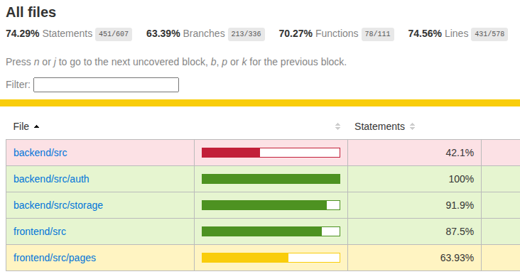

# Testing

## /backend

**Unitaire:**
Chaque fichier de test unitaire isole un seul composant à la fois (service, guard, contrôleur) en mockant ces dépendances (Prisma, S3, JWT). Cela permet une exécution très **rapide** et nous dispense des lourdeurs de l'interaction BDD ou AWS et teste la logique métier et les cas d’erreurs critiques.

**Intégration:**
Monte l’application NestJS complète avec des mocks pour Prisma et S3 puis envoie de vraies requêtes HTTP. Cela permet la vérification des routes, pipes de validation, guards JWT s'intègrent bien ensemble et couvre tous les endpoints **API** (auth, upload, download, fichiers).

Résultat => **80** tests avec **86**% de couverture en **1** seconde

#### Commandes associées:

```
# Tout exécuter (tests unitaires + intégration + couverture)
cd backend && npm test

# Mode watch (relance automatique à chaque modification)
npm run test:watch

# Rapport de couverture détaillé
npm run test:cov
```

## /frontend

Utilisation de [Cypress](https://www.cypress.io/#create) pour un parcours critique qui teste les fonctionnalités critiques de bout en bout. Contrairement aux tests unitaires backend qui simulent Prisma et S3, ici on utilise de vraies instances **Docker**. L'avantage est que l’on teste l'intégration réelle (_Prisma → Postgres, S3 SDK → MinIO_), et on peut pousser un vrai navigateur Cypress qui interagit avec l'interface React, qui appelle le backend, qui écrit dans la base et S3. Tout se remet à zéro à chaque run.

Il est composé de **5** tests, chaque test est **indépendant**. Il crée ses propres données via l'API avant de naviguer:

| #   |     Scénario     | Ce qui est testé                                                                                |
| --- | :--------------: | ----------------------------------------------------------------------------------------------- |
| 1   |   Inscription    | Remplir le formulaire d'inscription => redirection vers /login                                  |
| 2   |    Connexion     | Se connecter => token stocké dans localStorage => redirection vers /my-space                    |
| 3   |  Téléversement   | Envoyer un JPEG via l'UI => réponse 201 + message de confirmation                               |
| 4   |  Téléchargement  | Upload via l'API, navigation vers la page de download => clic sur "Télécharger" => fichier reçu |
| 5   | Espace personnel | Upload via l'API, connexion => vérifier que le fichier apparaît dans la liste                   |

#### Prérequis d'infrastrucrure

Les tests Cypress utilisent l'application _compléte_ autant que possible:

- **PostgreSQL** via Docker (port 5433, base `datashare_e2e`)
- **MinIO** (mock S3 via Docker sur port 9000, bucket `datashare-e2e`)
- **Backend NestJS** sur `http://localhost:3000`
- **Frontend Vite** sur `http://localhost:5173`

#### Commandes associées:

```
# Lancer tout l'E2E (infra Docker + serveurs + Cypress) depuis la racine du projet :
bash scripts/run-e2e.sh

# Ou, depuis le dossier frontend, si les serveurs tournent déjà :
npm run test:e2e
npm run test:e2e:cov     # Avec rapport de couverture
npm run test:e2e:open    # Interface graphique Cypress
```

Avec _test:e2e:cov_, Cypress génère un **rapport de couverture** du code frontend (via @cypress/code-coverage + vite-plugin-istanbul). Il est stocké dans frontend/coverage/ et copié automatiquement dans .nyc_output/ pour une éventuelle fusion avec la couverture backend.

Résultat => Une suite de **5** tests critiques E2E avec **63**% de couverture en **6** secondes

## Script master test

Un script `run-all-tests-with-coverage.sh` à la racine du projet dans /scripts permet de lancer tout le processus des tests unitaires, intégration et E2E avec **Docker** avec une couverture de test qui couvre tout le projet.

#### Infrastructure Docker des tests

Tout est défini dans le fichier `docker-compose.yml` à la racine du projet. Il contient 3 services :

1. `postgres-e2e` - La base de données

```
image: postgres:16-alpine
ports: 5433 → 5432
tmpfs: /var/lib/postgresql/data   ← en RAM, pas écrit sur le disque
healthcheck: pg_isready           ← attend que Postgres soit prêt
```

- Postgres tourne sur le port **5433** et non 5432 pour ne pas être en conflit avec une éventuelle instance locale
- Les données sont en `tempfs` (système de fichiers temporaires en RAM) => à chaque arrêt, la base est **vierge** garantissant l'isolation entre les runs

2. `minio-e2e` - Le stockage S3 local

```
image: minio/minio
command: server /data --console-address ":9001"
ports: 9000 → 9000 (API S3) et 9001 → 9001 (interface admin)
tmpfs: /data                       ← aussi en RAM
healthcheck: curl http://localhost:9000/minio/health/live
```

- MinIO émule AWS S3 en local, les credentials sont: `minioadmin` / `minioadmin123`
- Les données également en `tempfs`

3. `setup` - Initialisation

```
image: minio/mc                  ← "MinIO Client", boîte à outils en ligne de commande
depends_on: postgres-e2e + minio-e2e (condition: service_healthy)
```

Ce service crée le bucket S3 `datashare-e2e` via le CLI `mc`. Il se lance une fois que Postgres ET MinIO sont opérationnels (`service_healthy`) puis s'arrête.

Le script bash orchestre dans cet ordre:

```
1. docker compose down -v        ← Nettoie tout (conteneurs + volumes)
2. docker compose up -d          ← Lance Postgres + MinIO en arrière-plan
3. docker compose up setup       ← Attend la santé des services, crée le bucket, puis s'arrête
4. npx prisma migrate deploy     ← Crée les tables dans Postgres
5. npx prisma db seed            ← Insère des données de test
6. node dist/main &              ← Démarre le backend NestJS (port 3000)
7. npm run dev &                 ← Démarre le frontend Vite (port 5173)
8. Attente (polling HTTP)        ← Vérifie que les 2 serveurs répondent
9. npm run test                  ← Lance les tests backend (unitaires, intégration)
10. npx cypress run               ← Lance les tests E2E
11. docker compose down -v       ← Nettoie tout à la fin (même en cas d'erreur, grâce à trap)
```

### Couverture

Le script fusionne la couverture de test back et front et crée un rapport final grâce au plgin Istanbul et nycOutput. La couverture finale est de **74**%.



- **Rapport fusionné** : _coverage-merged/index.html_
- **Backend seul** : _backend/coverage/lcov-report/index.html_
- **Frontend seul** : _frontend/coverage/lcov-report/index.html_
